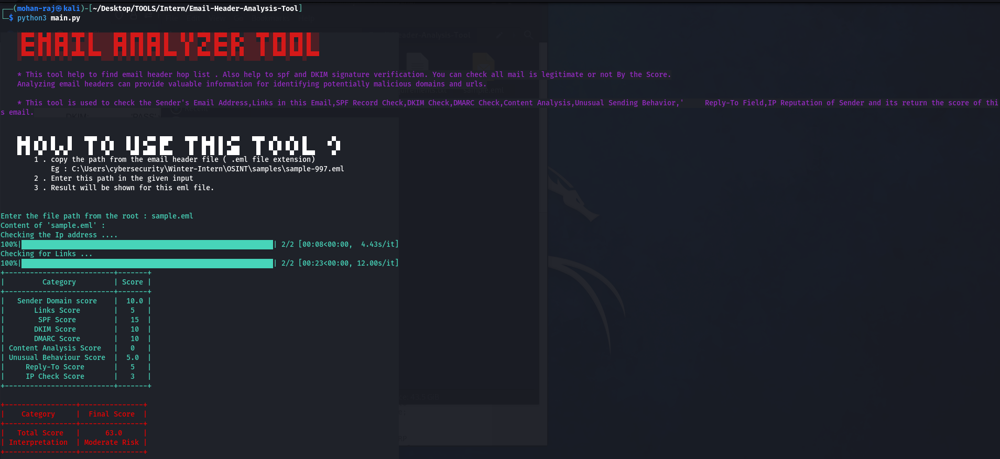

# Email-Header-Analysis-Tool

This tool help to find email header hop list . Also help to spf and DKIM signature verification. You can check all mail is legitimate or not By the Score. Analyzing email headers can provide valuable information for identifying potentially malicious domains and urls.

## Phishing Detection Algorithm

# Installation

## 1. Clone the repository using the following command: 

    $ git clone https://github.com/mohanrajmdev/Email-Header-Analysis-Tool.git

## 2. Navigate to the cloned directory:

    $ cd Email-Header-Analysis-Tool

# Required Packages
Command to install all packages 

    $ pip install -r requirements.txt

# Set Your Virustotal Api Key 
you will need to obtain API keys for the VirusTotal APIs. You can sign up for these services and obtain your API keys on the following websites:

* VirusTotal: https://www.virustotal.com/gui/join-us

set the Virustotal api to main.py python file
` vt_access_api = {virustotal_api_key} `

# To run the python file

    $ python3 main.py
